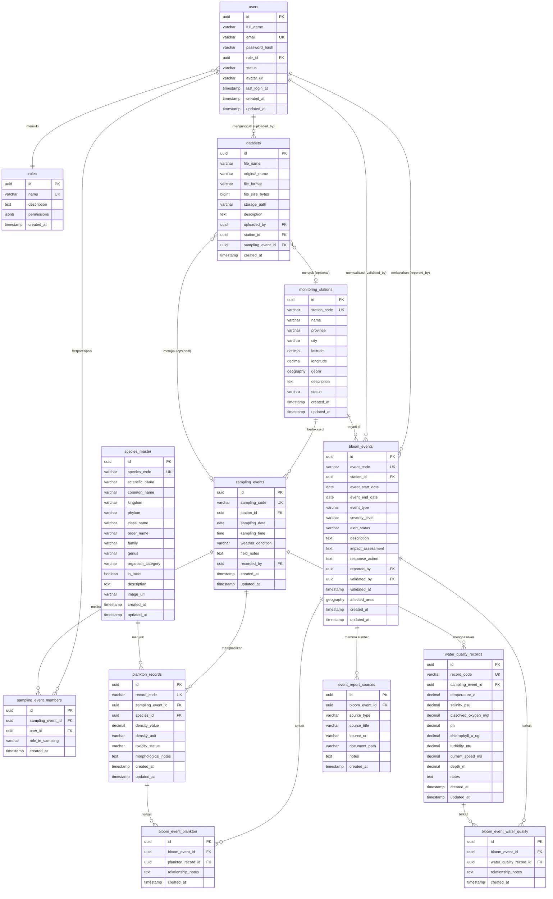

# Entity Relationship Diagram — JellyWatch (PostgreSQL)

Desain database untuk aplikasi monitoring laut **JellyWatch**, mencakup kualitas air, plankton/ubur-ubur, kejadian HABs & Jellyfish Bloom, manajemen dataset, serta autentikasi pengguna.

> [!NOTE]
> Versi final — telah diperbarui berdasarkan feedback:
> - Tabel `species_master` untuk konsistensi taksonomi
> - Junction `sampling_event_members` untuk multi-peneliti
> - Junction `bloom_event_plankton` untuk relasi eksplisit bloom ↔ plankton
> - Tabel `event_report_sources` untuk referensi sumber laporan (paper, dokumen, link)

---

## ERD (Mermaid)

---

## Deskripsi Entitas

### 1. `roles`
Definisi peran dan hak akses pengguna.

| Kolom | Tipe | Keterangan |
|---|---|---|
| `id` | `UUID` | Primary Key |
| `name` | `VARCHAR(50)` | Contoh: `'Admin'`, `'Peneliti'`, `'Viewer'` |
| `description` | `TEXT` | Deskripsi peran |
| `permissions` | `JSONB` | Hak akses terstruktur, misal `{"can_edit_stations": true, ...}` |
| `created_at` | `TIMESTAMPTZ` | Auto-generated |

---

### 2. `users`
Menyimpan data pengguna sistem (Peneliti, Admin, dll).

| Kolom | Tipe | Keterangan |
|---|---|---|
| `id` | `UUID` | Primary Key, default `gen_random_uuid()` |
| `full_name` | `VARCHAR(255)` | Nama lengkap pengguna |
| `email` | `VARCHAR(255)` | Email unik untuk login |
| `password_hash` | `VARCHAR(255)` | Hashed password (bcrypt/argon2) |
| `role_id` | `UUID` | FK → `roles.id` |
| `status` | `VARCHAR(20)` | `'aktif'`, `'nonaktif'`, `'suspended'` |
| `avatar_url` | `VARCHAR(512)` | URL foto profil (nullable) |
| `last_login_at` | `TIMESTAMPTZ` | Waktu login terakhir |
| `created_at` | `TIMESTAMPTZ` | Auto-generated |
| `updated_at` | `TIMESTAMPTZ` | Auto-updated |

---

### 3. `monitoring_stations`
Master data stasiun pemantauan di pesisir/laut Indonesia.

| Kolom | Tipe | Keterangan |
|---|---|---|
| `id` | `UUID` | Primary Key |
| `station_code` | `VARCHAR(20)` | Kode unik, e.g., `ST-01` |
| `name` | `VARCHAR(255)` | Nama stasiun |
| `province` | `VARCHAR(100)` | Provinsi |
| `city` | `VARCHAR(100)` | Kabupaten/Kota |
| `latitude` | `DECIMAL(10,7)` | Lintang (WGS84) |
| `longitude` | `DECIMAL(10,7)` | Bujur (WGS84) |
| `geom` | `GEOGRAPHY(Point, 4326)` | PostGIS geometry untuk spatial query |
| `description` | `TEXT` | Deskripsi lokasi/kondisi |
| `status` | `VARCHAR(20)` | `'aktif'`, `'nonaktif'` |
| `created_at` | `TIMESTAMPTZ` | Auto-generated |
| `updated_at` | `TIMESTAMPTZ` | Auto-updated |

> [!TIP]
> Kolom `geom` menggunakan ekstensi **PostGIS** untuk mendukung spatial query pada halaman WebGIS (pencarian radius, intersection, dll).

---

### 4. `sampling_events`
Log setiap kegiatan pengambilan sampel lapangan.

| Kolom | Tipe | Keterangan |
|---|---|---|
| `id` | `UUID` | Primary Key |
| `sampling_code` | `VARCHAR(20)` | Kode unik, e.g., `SMP-001` |
| `station_id` | `UUID` | FK → `monitoring_stations.id` |
| `sampling_date` | `DATE` | Tanggal sampling |
| `sampling_time` | `TIME` | Jam sampling (nullable) |
| `weather_condition` | `VARCHAR(50)` | `'Cerah'`, `'Berawan'`, `'Hujan Ringan'`, dst. |
| `field_notes` | `TEXT` | Catatan lapangan |
| `recorded_by` | `UUID` | FK → `users.id` (pencatat utama/PJ) |
| `created_at` | `TIMESTAMPTZ` | Auto-generated |
| `updated_at` | `TIMESTAMPTZ` | Auto-updated |

---

### 5. `sampling_event_members` *(BARU)*
Junction table untuk mencatat **multi-peneliti** yang terlibat dalam satu sampling event.

| Kolom | Tipe | Keterangan |
|---|---|---|
| `id` | `UUID` | Primary Key |
| `sampling_event_id` | `UUID` | FK → `sampling_events.id` |
| `user_id` | `UUID` | FK → `users.id` |
| `role_in_sampling` | `VARCHAR(50)` | Peran dalam sampling: `'Ketua Tim'`, `'Analis Lapangan'`, `'Pengambil Sampel'`, `'Pencatat'` |
| `created_at` | `TIMESTAMPTZ` | Auto-generated |

> [!NOTE]
> Kolom `recorded_by` di `sampling_events` tetap ada sebagai pencatat utama (penanggung jawab). Tabel ini mencatat seluruh anggota tim yang terlibat.
> 
> **Constraint**: `UNIQUE(sampling_event_id, user_id)` — satu user hanya satu peran per sampling.

---

### 6. `species_master` *(BARU)*
Tabel referensi taksonomi spesies untuk konsistensi data plankton & ubur-ubur.

| Kolom | Tipe | Keterangan |
|---|---|---|
| `id` | `UUID` | Primary Key |
| `species_code` | `VARCHAR(20)` | Kode unik internal, e.g., `SPM-001` |
| `scientific_name` | `VARCHAR(255)` | Nama ilmiah (Latin), e.g., `'Pyrodinium bahamense'` |
| `common_name` | `VARCHAR(255)` | Nama umum/lokal (nullable) |
| `kingdom` | `VARCHAR(100)` | Kingdom, e.g., `'Chromista'`, `'Animalia'` |
| `phylum` | `VARCHAR(100)` | Filum |
| `class_name` | `VARCHAR(100)` | Kelas (menggunakan `class_name` karena `class` adalah reserved word) |
| `order_name` | `VARCHAR(100)` | Ordo |
| `family` | `VARCHAR(100)` | Famili |
| `genus` | `VARCHAR(100)` | Genus |
| `organism_category` | `VARCHAR(30)` | `'Fitoplankton'`, `'Zooplankton'`, `'Ubur-ubur'` |
| `is_toxic` | `BOOLEAN` | Apakah spesies ini berpotensi toksik? Default `false` |
| `description` | `TEXT` | Deskripsi spesies |
| `image_url` | `VARCHAR(512)` | URL gambar referensi (nullable) |
| `created_at` | `TIMESTAMPTZ` | Auto-generated |
| `updated_at` | `TIMESTAMPTZ` | Auto-updated |

---

### 7. `water_quality_records`
Parameter fisik-kimia lingkungan laut per sampling event.

| Kolom | Tipe | Keterangan |
|---|---|---|
| `id` | `UUID` | Primary Key |
| `record_code` | `VARCHAR(20)` | Kode unik, e.g., `WQ-101` |
| `sampling_event_id` | `UUID` | FK → `sampling_events.id` |
| `temperature_c` | `DECIMAL(5,2)` | Suhu air (°C) |
| `salinity_psu` | `DECIMAL(5,2)` | Salinitas (PSU) |
| `dissolved_oxygen_mgl` | `DECIMAL(5,2)` | DO (mg/L) |
| `ph` | `DECIMAL(4,2)` | pH air |
| `chlorophyll_a_ugl` | `DECIMAL(8,2)` | Klorofil-a (µg/L) — **indikator kunci HABs** |
| `turbidity_ntu` | `DECIMAL(7,2)` | Kekeruhan (NTU), nullable |
| `current_speed_ms` | `DECIMAL(5,2)` | Kecepatan arus (m/s), nullable |
| `depth_m` | `DECIMAL(6,2)` | Kedalaman pengukuran (m), nullable |
| `notes` | `TEXT` | Catatan tambahan |
| `created_at` | `TIMESTAMPTZ` | Auto-generated |
| `updated_at` | `TIMESTAMPTZ` | Auto-updated |

---

### 8. `plankton_records`
Data kelimpahan spesies fitoplankton, zooplankton, dan ubur-ubur. **Sekarang merujuk ke `species_master`.**

| Kolom | Tipe | Keterangan |
|---|---|---|
| `id` | `UUID` | Primary Key |
| `record_code` | `VARCHAR(20)` | Kode unik, e.g., `PLK-101`, `JEL-103` |
| `sampling_event_id` | `UUID` | FK → `sampling_events.id` |
| `species_id` | `UUID` | FK → `species_master.id` |
| `density_value` | `DECIMAL(12,2)` | Nilai kepadatan |
| `density_unit` | `VARCHAR(30)` | Satuan: `'sel/L'`, `'ind/m²'`, `'ind/m³'` |
| `toxicity_status` | `VARCHAR(30)` | `'Beracun'`, `'Tidak'`, `'Iritasi Ringan'` (override per observasi) |
| `morphological_notes` | `TEXT` | Catatan morfologi |
| `created_at` | `TIMESTAMPTZ` | Auto-generated |
| `updated_at` | `TIMESTAMPTZ` | Auto-updated |

---

### 9. `bloom_events`
Pencatatan kejadian HABs (Harmful Algal Blooms) dan Jellyfish Bloom yang berlangsung dalam rentang waktu tertentu.

| Kolom | Tipe | Keterangan |
|---|---|---|
| `id` | `UUID` | Primary Key |
| `event_code` | `VARCHAR(30)` | Kode unik, e.g., `EVT-202607-01` |
| `station_id` | `UUID` | FK → `monitoring_stations.id` |
| `event_start_date` | `DATE` | Tanggal mulai kejadian |
| `event_end_date` | `DATE` | Tanggal selesai kejadian (nullable jika masih berlangsung) |
| `event_type` | `VARCHAR(50)` | `'Harmful Algal Blooms'`, `'Jellyfish Bloom'` |
| `severity_level` | `VARCHAR(20)` | `'rendah'`, `'sedang'`, `'tinggi'`, `'kritis'` |
| `alert_status` | `VARCHAR(20)` | `'Normal'`, `'Waspada'`, `'Siaga'`, `'Darurat'` |
| `description` | `TEXT` | Kronologi kejadian |
| `impact_assessment` | `TEXT` | Dampak terhadap lingkungan/masyarakat |
| `response_action` | `TEXT` | Tindakan yang diambil |
| `reported_by` | `UUID` | FK → `users.id` (pelapor) |
| `validated_by` | `UUID` | FK → `users.id` (validator, nullable) |
| `validated_at` | `TIMESTAMPTZ` | Waktu validasi |
| `affected_area` | `GEOGRAPHY(Polygon, 4326)` | Area terdampak (PostGIS polygon) |
| `created_at` | `TIMESTAMPTZ` | Auto-generated |
| `updated_at` | `TIMESTAMPTZ` | Auto-updated |

---

### 10. `event_report_sources`
Mencatat **sumber laporan** untuk setiap bloom event. Satu kejadian bisa memiliki banyak sumber (paper, laporan lapangan, laporan masyarakat, citra satelit, dll).

| Kolom | Tipe | Keterangan |
|---|---|---|
| `id` | `UUID` | Primary Key |
| `bloom_event_id` | `UUID` | FK → `bloom_events.id` |
| `source_type` | `VARCHAR(50)` | `'Laporan Lapangan'`, `'Laporan Masyarakat'`, `'Paper/Jurnal'`, `'Citra Satelit'`, `'Media Berita'` |
| `source_title` | `VARCHAR(500)` | Judul paper/dokumen/berita |
| `source_url` | `VARCHAR(1024)` | URL referensi (link paper, berita, DOI, dll) |
| `document_path` | `VARCHAR(512)` | Path file dokumen pendukung di storage (nullable) |
| `notes` | `TEXT` | Catatan tambahan tentang sumber |
| `created_at` | `TIMESTAMPTZ` | Auto-generated |

---

### 11. `bloom_event_plankton`
Junction table untuk relasi **Many-to-Many** antara bloom events dan plankton records.

| Kolom | Tipe | Keterangan |
|---|---|---|
| `id` | `UUID` | Primary Key |
| `bloom_event_id` | `UUID` | FK → `bloom_events.id` |
| `plankton_record_id` | `UUID` | FK → `plankton_records.id` |
| `relationship_notes` | `TEXT` | Catatan hubungan, e.g., `"Spesies dominan penyebab bloom"` |
| `created_at` | `TIMESTAMPTZ` | Auto-generated |

---

### 12. `bloom_event_water_quality` *(BARU)*
Junction table untuk relasi **Many-to-Many** antara bloom events dan parameter kualitas air (`water_quality_records`).

| Kolom | Tipe | Keterangan |
|---|---|---|
| `id` | `UUID` | Primary Key |
| `bloom_event_id` | `UUID` | FK → `bloom_events.id` |
| `water_quality_record_id` | `UUID` | FK → `water_quality_records.id` |
| `relationship_notes` | `TEXT` | Catatan parameter pemicu/indikator, e.g., `"Suhu 29.5°C & Klorofil-a tinggi memicu ledakan"` |
| `created_at` | `TIMESTAMPTZ` | Auto-generated |

---

### 13. `datasets`
Manajemen file dataset (CSV, PDF, Excel) yang diunggah ke sistem.

| Kolom | Tipe | Keterangan |
|---|---|---|
| `id` | `UUID` | Primary Key |
| `file_name` | `VARCHAR(255)` | Nama file di storage |
| `original_name` | `VARCHAR(255)` | Nama file asli saat diupload |
| `file_format` | `VARCHAR(10)` | `'CSV'`, `'PDF'`, `'XLSX'` |
| `file_size_bytes` | `BIGINT` | Ukuran file dalam bytes |
| `storage_path` | `VARCHAR(512)` | Path di object storage / disk |
| `description` | `TEXT` | Deskripsi isi dataset |
| `uploaded_by` | `UUID` | FK → `users.id` |
| `station_id` | `UUID` | FK → `monitoring_stations.id` (nullable) |
| `sampling_event_id` | `UUID` | FK → `sampling_events.id` (nullable) |
| `created_at` | `TIMESTAMPTZ` | Auto-generated |
